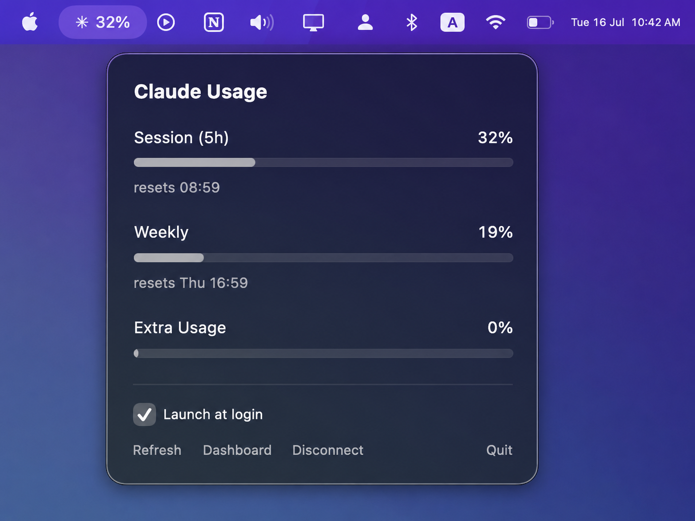

# ClaudeBar

A native macOS menu bar app that shows your Claude usage limits — session (5-hour), weekly, and weekly Opus — the same numbers the claude.ai dashboard and Claude Code's `/usage` command show.



- Lives in your menu bar: `✳ 61%` (your highest limit at a glance)
- Popover with progress bars and reset times for each limit window
- Mac-native design, adapts to light/dark mode
- Refreshes every 5 minutes and whenever you open it
- Launch-at-login toggle
- Zero third-party dependencies — pure SwiftUI, ~400 lines

## Install

```bash
git clone https://github.com/ousid/claudebar
cd claudebar
./scripts/build-app.sh
cp -r ClaudeBar.app /Applications/
open /Applications/ClaudeBar.app
```

Requires macOS 13+ and the Swift toolchain — `xcode-select --install` is enough, no Xcode needed.

## Connect your account

Click the ✳ icon → **Connect Claude Account**. Your browser opens claude.ai; approve access, copy the code shown, and paste it into the popover. That's it.

## Security & privacy

- ClaudeBar signs in with its own OAuth token requesting only the read-only `user:profile` scope — it can see your usage numbers and nothing else. It cannot send messages or spend your quota, even if the token were stolen.
- The token is stored in your macOS Keychain (`com.claudebar.oauth`, this-device-only) and never leaves your machine.
- The app talks only to Anthropic endpoints (`claude.ai`, `api.anthropic.com`, `console.anthropic.com`). No analytics, no third-party servers.
- The OAuth flow uses PKCE (S256) with state verification.

## Uninstall

```bash
rm -rf /Applications/ClaudeBar.app
security delete-generic-password -s com.claudebar.oauth
```

## Disclaimer

ClaudeBar is an independent open-source project, not affiliated with or endorsed by Anthropic. It uses the same public OAuth endpoints the official Claude Code CLI uses; these are undocumented and may change.

## License

[MIT](LICENSE)
